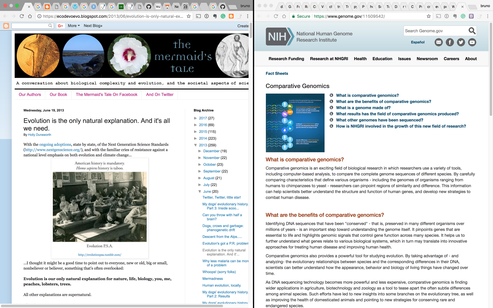
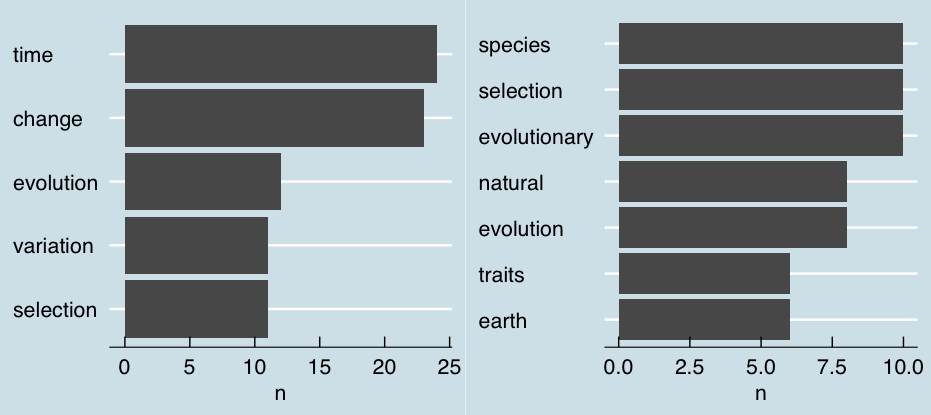
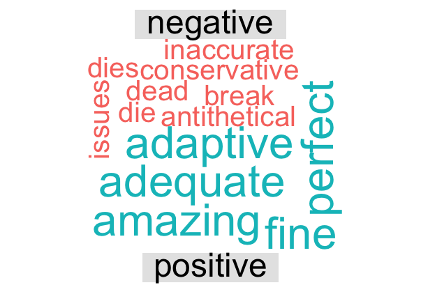
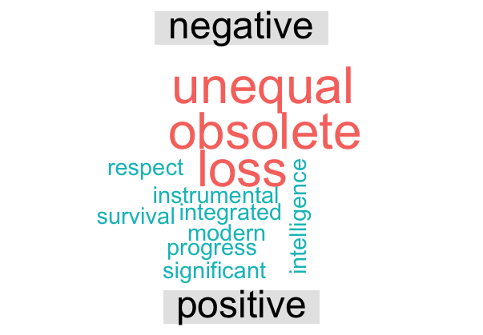

2017 has been a bad year for science.
A certain political figure who happens to lead what is arguably most powerful nation in the world took decided not to believe in science and made his mission to minimize the potential impact of the said nation's scientists (through severe cuts in scientific funding, for example). Because some scientists that care about their work are having a hard time to actually convey their findings, the popularization of science is more important than ever. Randal from XKCD, who happens to be my personal hero, did a stellar job using really cool data visualization to explaining [why climate change is a big deal](https://xkcd.com/1732/).

As an assignment for my anthropology class in human evolution, I was given a [blog post](https://ecodevoevo.blogspot.com/2013/06/evolution-is-only-natural-explanation.html) from an actual scientist (sorry Randal), that tries to explain the evolution in an approachable way. To me, this blog post explains the idea of evolution better than any textbook did, not only because it is a blog post (which, unlike textbooks is not [scary](https://cnet4.cbsistatic.com/img/f7_I9wHgPC6ZPJW-hLtuI0LZWF4=/0x94:1200x700/fit-in/970x0/2015/03/30/86f92c8d-4d7d-4074-88a8-554a19b76346/monsterbook1.jpg), nor expensive), but also because it doesn’t use big intangible words and doesn’t bother going into details and specifics of things like _genetic drift_, or _comparative genetics_. It rather mentions them in a subtle, almost mysterious way, which _engages_ the reader to overload their browser tabs with numerous NCBI and Wikipedia pages, and delves into the depths of youtube, Wikipedia, and Tumblr. This approach is ingenious, as it is a very effective way to overcome all attention disorders that kids tend to have nowadays by exploiting it, rather than ignoring it.

_Actual state of my tabs 40 minutes in the reading period_

Furthermore, it is amazing because it captures the essence of evolution, as a scientific theory in a way that made me excited by it. During my brief biology training, I have studied evolution several times, yet I never found it particularly exciting.
It was always a bunch of definitions, that happen somehow, somewhere, make sense, and have nothing to do with that [Lamarck’s Giraffes](http://hawaiireedlab.com/wpress/wp-content/uploads/2016/05/lamarck_giraffe2.jpg). The closest thing to exciting was an intro to comparative genetics, which is, according to my high-school professors, too complicated to understand. 

Naturally, I found it to be a bunch of gibberish. A brief look at Dunsworth’s blog and the words she uses tells you straight away what evolution really is about.

_Comparison of most used words in the article (left) and Wikipedia introduction (on the right)_

And, if I'm parsing it correctly, it is about 3 things: **time, change, and (natural) selection**. And the one that stuck the most to me, and the one I spent most time googling around for is time.

### Digression: a quick note about time
Time is an amazing concept that has had a profound effect on people for centuries. It equally fascinated scientists and philosophers throughout the history. During my entire freshman year, I had a small [geektool](https://www.tynsoe.org/v2/geektool/) applet with the expected days left alive; it was a small reminder of how short we get to be alive [1]. Interestingly enough that is one of the main points of the article, and one of the reasons I had a hard time grasping the concept: **you and I are going to be dead long before we would have the chance see the evolution happening**. 

### ... back to the article

Not only is Dunsworth's blog more suitable, but it is somehow ... nicer than most textbooks (I know, I know, bear with me on this one). It doesn't seem to be condescending - it is just like a letter from a (very clear thinking) person to the other. It at least partially due to the informal style of writing, but I suspect at least small part of it a consequence of her word choice. Her words are less-complicated and, according to the Bing's scale of sentimental connotations of particular words, more positive

 
 _Positive vs negative words in the blog post_

while the one on Wikipedia seems to be more complicated, and proportionally more negative.

!
_Positive vs negative words in the Wikipedia article on evolution_

### To sum up

Thanks to Dunsworth, for the first time evolution _does_ make sense, once you put it in the right perspective - it is about change over time. The change is not linear, it is incremental. "Inherited genetic material that's involved in growth, development, metabolism, reproduction, etc... (i.e. all life's processes) is *evolving with each and every generation*". There are no [turtles all the way down](https://en.wikipedia.org/wiki/Turtles_all_the_way_down); it's not magic. Just like a change in a hidden Markov model, **"everything is because of what came before"**.

Articles like these give me hope that science is still available and approachable. One just needs to look for it.

---
[1] interestingly enough, Schopenhauer found this idea to be the cause for resignation, Nietzche used exactly the same concept and argued that Greek art and culture were a direct consequence
of the fact that this is a race we’ll always loose